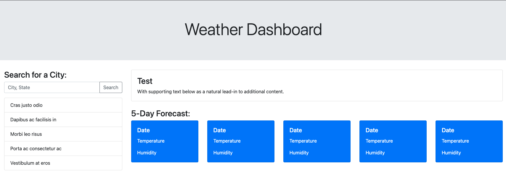

# Weather-Dashboard

## Goals for this assignment

* Search for a city
    * Use the OpenWeatherMap API to pull city weather data based on user search input
    * Show the current weather
    * Show the 5 day forecast
* See search history
    * After the user searches a new city, the previous city is prepended to the search history below
    * Use localStorage to save the search history, even after the page has been refreshed

## Links

* [GitHub Repo](https://github.com/elizabethbrandt/Weather-Dashboard)
* [Depoloyed Site](https://elizabethbrandt.github.io/Weather-Dashboard/)

## Lessons I learned from this assignment

#### Building a site from scratch using Bootstrap

* Using Bootstrap just to get the basic framework down saved me A LOT of time. It enabled me to focus more of my time and efforts on making sure the API worked and pulled in the correct information.
* I was able to later customize any css that I wanted to later on
* Here's a look at what the site looked like using only Bootstrap:

    

#### Working with an open source API